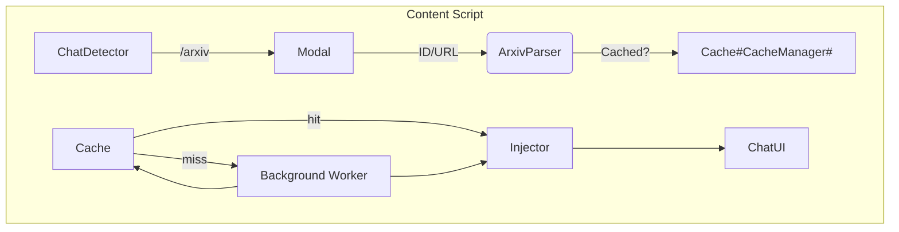

# arXiv AI Extension&nbsp;🚀  

[](LICENSE)  
*A browser add-on that lets you import arXiv papers into your favourite AI chat platforms in one click.*

---

## ✨ Key Features
- **Slash Command Trigger** – type `/arxiv` in the chat box to open the import dialog.  
- **Automatic PDF Handling** – paste an arXiv ID or URL, the extension downloads the PDF and uploads it for you.  
- **Smart Cache** – downloaded papers are cached for **7 days** to avoid redundant traffic.  
- **Live Progress Bar** – see real-time download & upload progress.  
- **Multi-Platform Support** –  
  • **Chromium browsers**: ChatGPT, Google Gemini, AI Studio  
  • **Firefox**: currently supports ChatGPT only (see details below)

---

## 🎬 Demo

See the extension in action:

<video width="800" controls>
  <source src="demo.mp4" type="video/mp4">
  Your browser does not support the video tag.
</video>

*The demo shows how to use the `/arxiv` command to quickly import arXiv papers into ChatGPT with automatic PDF download and upload.*

---

## 🌍 Supported Sites
| Platform | Domain |
|----------|--------|
| ChatGPT  | `chat.openai.com`, `chatgpt.com` |
| Gemini   | `gemini.google.com` |
| AI Studio| `aistudio.google.com` |

> ⚠️ **Firefox limitation:** Gemini and AI Studio hide their file-upload inputs inside a *closed Shadow DOM*, and Firefox’s security model blocks content scripts from creating `DataTransfer` objects that contain files. Automatic upload therefore works only in Chromium-based browsers; on Firefox the extension currently supports ChatGPT only.

---

## 🔧 Installation

### Chrome / Edge
1. Clone or download this repo.  
2. Visit `chrome://extensions/` (Chrome) or `edge://extensions/` (Edge).  
3. Enable **Developer mode**.  
4. Click **Load unpacked** and select the **`arxiv-ai-extension`** folder.  

### Firefox
1. Open `about:debugging#/runtime/this-firefox`.  
2. Click **Load Temporary Add-on…**.  
3. Select `arxiv-ai-extension/manifest_firefox.json`.  

> Permanent distribution on AMO / Chrome Web Store will be available soon.

---

## ⚡ Quick Start
1. Open ChatGPT, Gemini or AI Studio.  
2. In the chat input, type `/arxiv` & hit **Enter**.  
3. Enter an arXiv ID or URL, e.g. `2506.05046` or `https://arxiv.org/abs/2506.05046`.  
4. Watch the progress bar – the PDF will appear in the chat just like a manual upload!  

---

## 🎯 Advanced Tips
- **Context-Menu Import** – select any arXiv link on a page, right-click → **Import as arXiv paper**.  
- **Cache Control** – click the extension icon to view statistics or clear cache.  
- **Self-Test** – the popup includes a **Test Import** button for quick diagnostics.  

---

## 📁 Project Structure
```text
arxiv-ai-extension/
├─ manifest.json            # Chrome/Edge manifest (MV3)
├─ manifest_v2.json         # Firefox manifest (MV2)
├─ background/
│  └─ service-worker.js     # Background logic
├─ content-scripts/
│  ├─ main.js               # Entry point
│  ├─ chat-detector.js      # Listens for /arxiv command
│  ├─ file-injector.js      # Handles drag-and-drop upload
│  └─ site-configs.js       # Per-site selectors & quirks
├─ utils/
│  ├─ arxiv-parser.js       # Robust link / ID parser
│  ├─ cache-manager.js      # Local storage with expiry
│  └─ progress-tracker.js   # Bottom progress bar helper
├─ components/              # Popup & modal assets
└─ assets/icons/            # Extension icons
```

---

## 🏗️ Architecture


---

## 🛠️ Development
1. `git clone https://github.com/your-username/arxiv-ai-extension.git`  
2. Load the folder as unpacked extension (see *Installation*).  
3. Hack away – after editing, just refresh the extension page or click **Ctrl/Cmd + R** in DevTools.  

### Add a New Chat Platform
1. Add a config block in `content-scripts/site-configs.js`.  
2. Add the host to `manifest.json > host_permissions`.  
3. Validate selectors & upload method.

---

## 🤝 Contributing
PRs & issues are welcome!  
1. Fork → create feature branch → code → open PR.  
2. Please follow existing code style and include screenshots / gifs for UI changes.

---

## 📜 License
Released under the MIT License – see [`LICENSE`](LICENSE) for details.

---

Enjoy a more productive research workflow with **arXiv AI Extension**! 🌟
